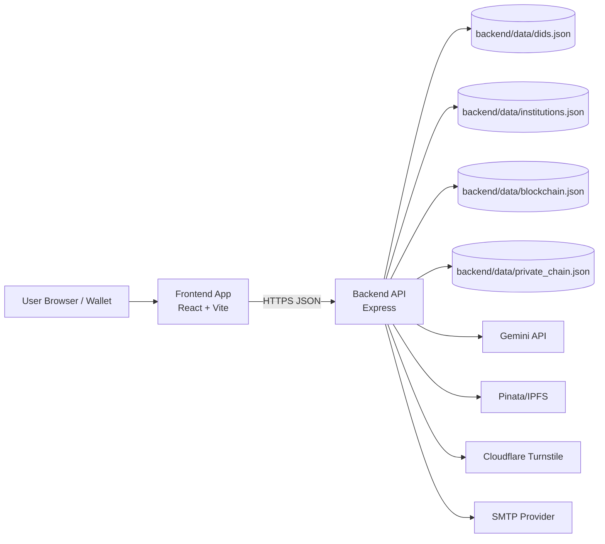
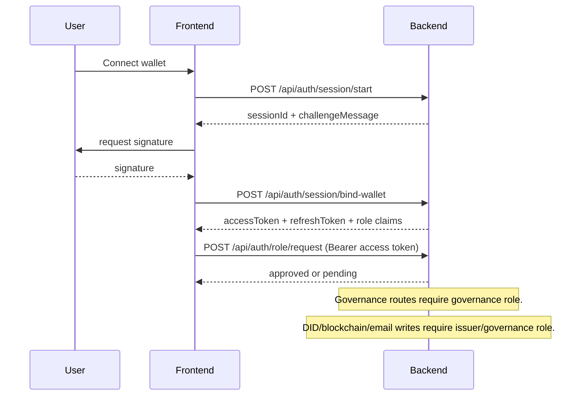
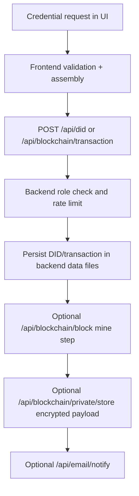
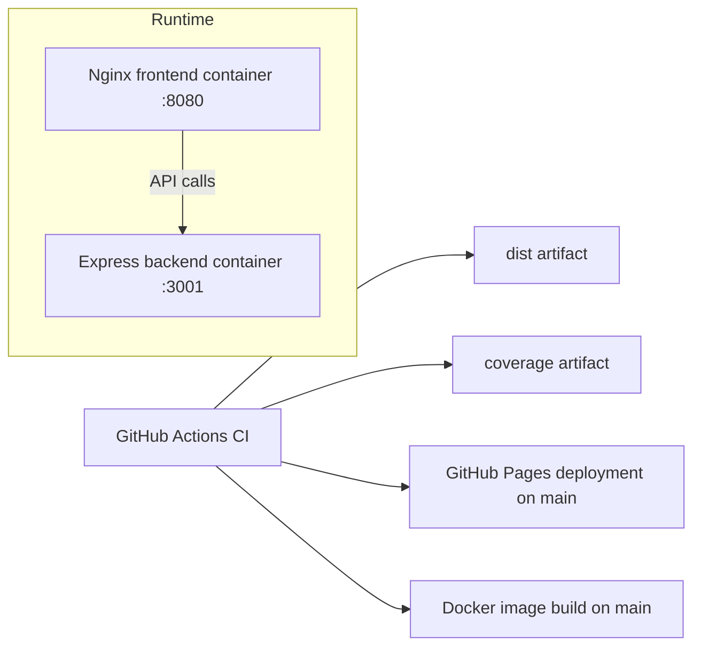

# Architecture Diagram

## System Overview

Morningstar Credentials is a split frontend/backend architecture:

- Frontend (React/Vite) handles UX, wallet interactions, and session token usage.
- Backend (Express) brokers external APIs, enforces role-based writes, and persists local state.
- Optional third-party services provide AI schema/trust analysis, IPFS pinning, CAPTCHA, and SMTP delivery.

## Component Diagram

## Auth and Role Flow

## Credential Issuance Path

## Backend Route Groups

- Health: `/health`, `/api/health`, `/api/email/health`
- Auth/session: `/api/auth/session/*`, `/api/auth/student/email/*`, `/api/auth/role/*`
- Governance: `/api/governance/institutions` (`POST/PATCH` protected)
- DID: `/api/did` (`POST/PUT/DELETE` protected)
- Blockchain: `/api/blockchain/*` (write routes protected)
- External proxies: `/api/gemini/*`, `/api/ipfs/*`
- Notification/MFA: `/api/email/notify`, `/api/mfa/send-otp` (protected)

## Deployment Topology

## Key Implementation Notes

- Write-route auth is user session token based, not static frontend bearer token configuration.
- Backend persistence is file-based and appropriate for single-instance or persistent-volume deployments.
- External providers are optional at runtime; endpoints fail gracefully when credentials are missing.
